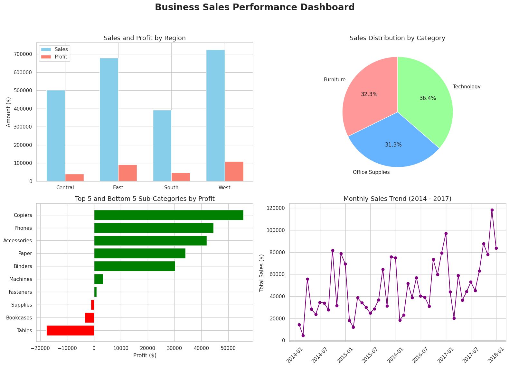

# FUTURE_DS_01: Business Sales Performance Analytics

## 📌 Project Overview
This project involves analyzing the sales and profit data of a Superstore to identify revenue trends, top-selling products, high-value categories, and regional performance. 

## 📊 Key Findings & Insights
1. **Category Performance:** The **Technology** category dominates, accounting for nearly 85.8% of total sales and generating the highest profit. **Furniture**, conversely, is operating at a net loss despite bringing in sales.
2. **Regional Performance:** The **West** and **East** regions are highly profitable. However, the **South** region is struggling severely, reporting a net loss of -$381. 
3. **Sub-Category Extremes:** **Copiers, Phones, and Accessories** are the highest drivers of profit. On the other hand, **Tables and Bookcases** are bleeding money and are the top contributors to the company's losses.
4. **Time Trends:** Sales exhibit strong seasonality, with massive spikes consistently appearing in the final months of the year (Q4 / Holiday Season).

## 💡 Actionable Recommendations
* **Review Furniture Pricing & Discounts:** The deep losses in Furniture (specifically Tables and Bookcases) suggest that discounts may be too aggressive or shipping costs are too high. Consider reducing discounts on these items.
* **Investigate the South Region:** Conduct a deep-dive into the South region's operations. The high sales volume but negative profit indicates structural issues, such as high overhead, extreme discounting, or logistical inefficiencies. 
* **Capitalize on Q4 Seasonality:** Since sales reliably peak at the end of the year, marketing budgets and inventory supply for top-performers (like Copiers and Phones) should be heavily stacked toward Q3/Q4.
